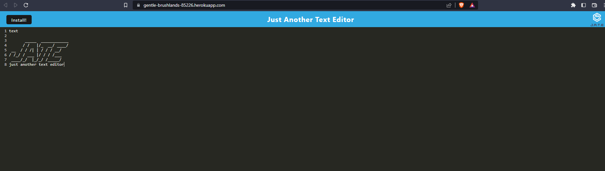

  # MSUBC_Module19_CH Text Editor by Mateusz Zielinski
  ## Description
  This Program is a simple text editor utilizing PWA's to compile for distribution
  
  
  ## License
  
  This application is not currently under any license agreement.
  ## Table of Contents
  - [License](#License)
  - [Testing](#Testing)
  - [Contributing](#Contributing)
  ## Testing
  no tests
  ## Contributing
  contibute however you want i don't care
  ## Questions
  Github:<https://github.com/IMadeThisJustToPostThis>
  
  Email: zielinm2@mail.lcc.edu